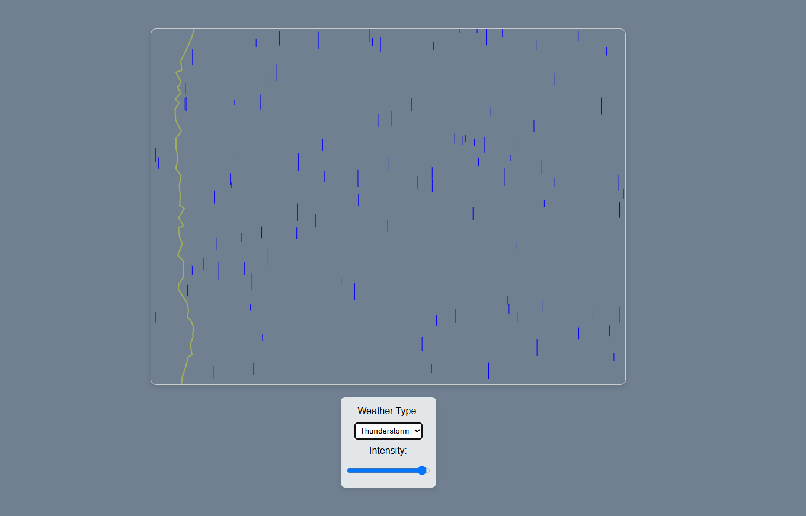

# Weather Simulation

Welcome to the Weather Simulation project! This repository contains a weather simulation application that models various weather patterns and conditions.

## How It Works

The weather simulation application uses a combination of algorithms and data to simulate realistic weather conditions. The main components of the application include:

- **Weather Data Generation**: Generates random weather data based on predefined parameters such as location, time of year, and historical weather patterns.
- **Weather Visualization**: Displays the generated weather data in a user-friendly interface using charts, graphs, and animations.
- **Weather Analysis**: Analyzes the generated weather data to provide insights and predictions, including trends, anomalies, and forecasts.

## Functions in the Code

Here are some of the key functions in the code:

- `generateWeatherData()`: Generates random weather data including temperature, humidity, wind speed, and precipitation. It uses statistical models to ensure the data is realistic.
- `displayWeatherData(data)`: Displays the generated weather data on the user interface. It updates the visual elements dynamically to reflect changes in the data.
- `analyzeWeatherData(data)`: Analyzes the weather data to provide insights such as average temperature, humidity trends, and more. It uses data analysis techniques to identify patterns and make predictions.
- `saveWeatherData(data)`: Saves the generated weather data to a file or database for future reference or further analysis.
- `loadWeatherData()`: Loads previously saved weather data for analysis or visualization.

## Screenshot



## Live Demo

Check out the live demo of the weather simulation application [here](https://pakkid.github.io/weather-sim/).

## Getting Started

To get started with the weather simulation application, follow these steps:

1. Clone the repository:
    ```bash
    git clone https://github.com/pakkid/weather-sim.git
    ```
2. Navigate to the project directory:
    ```bash
    cd weather-sim
    ```
3. Open the `index.html` file in your web browser to run the application.

## License

This project is licensed under the MIT License. See the [LICENSE](LICENSE) file for details.